# Personal-Finance-Tracker-Web-App
A personal finance tracking web application developed using HTML, CSS, JavaScript, PHP, and SQL for managing income, expenses, budgets, and financial records.

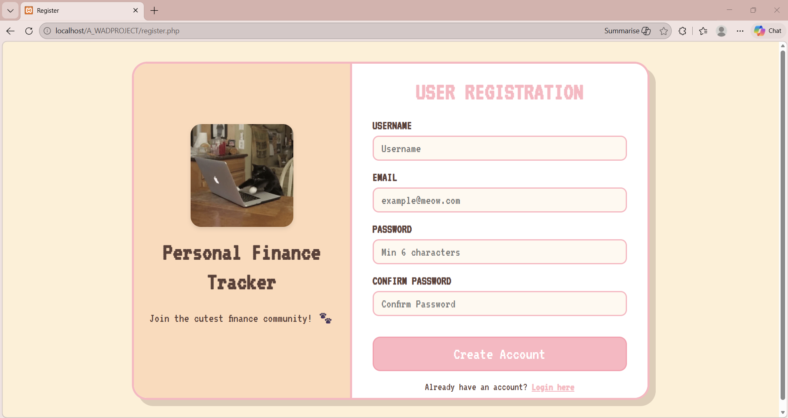

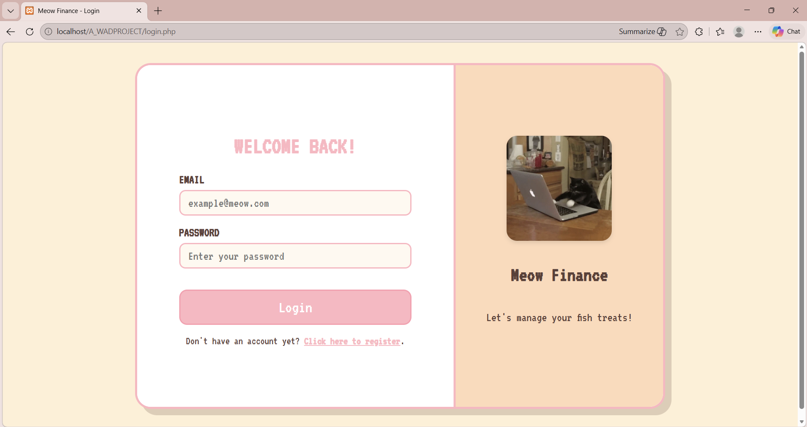

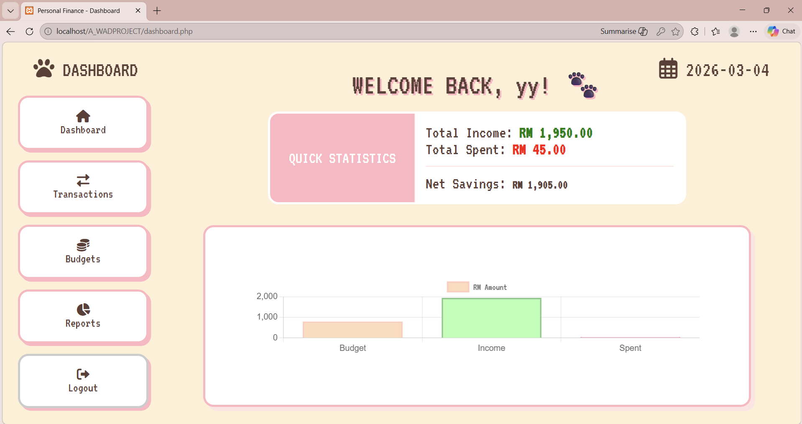

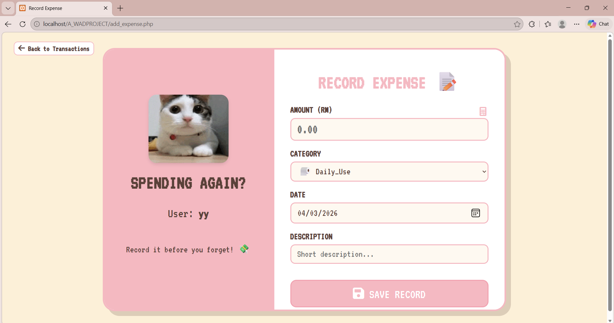

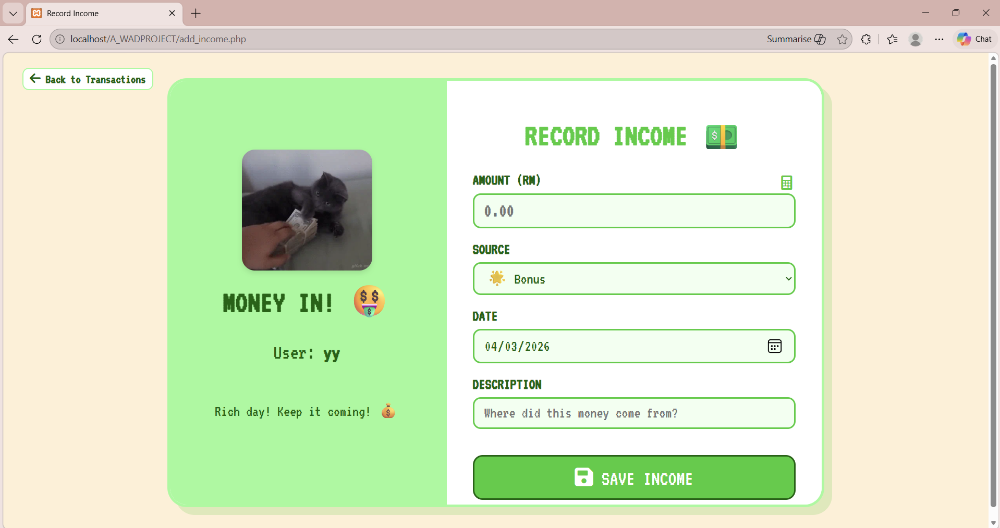

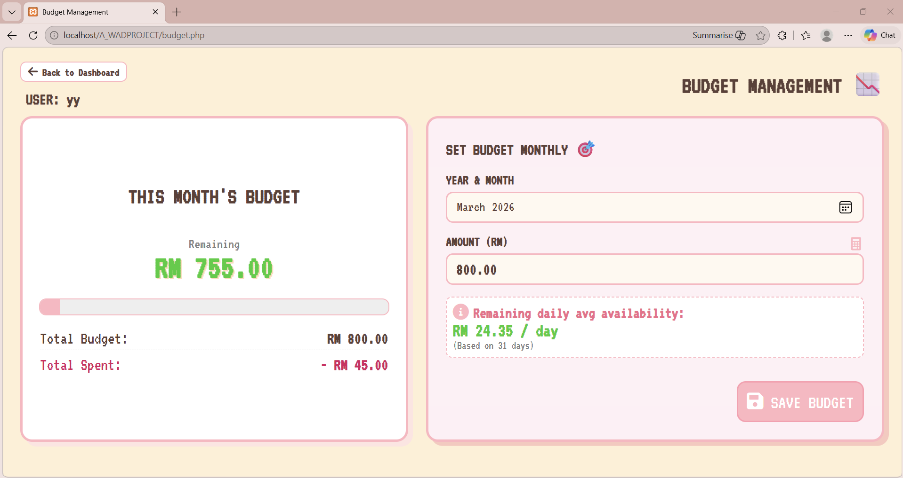

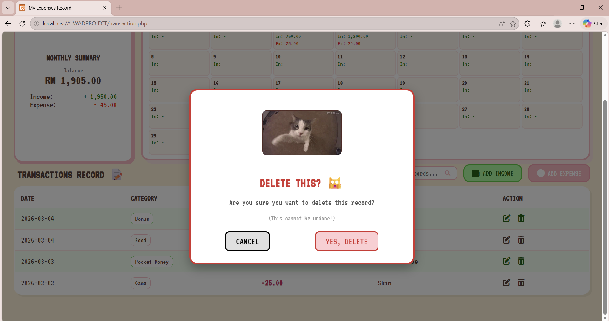

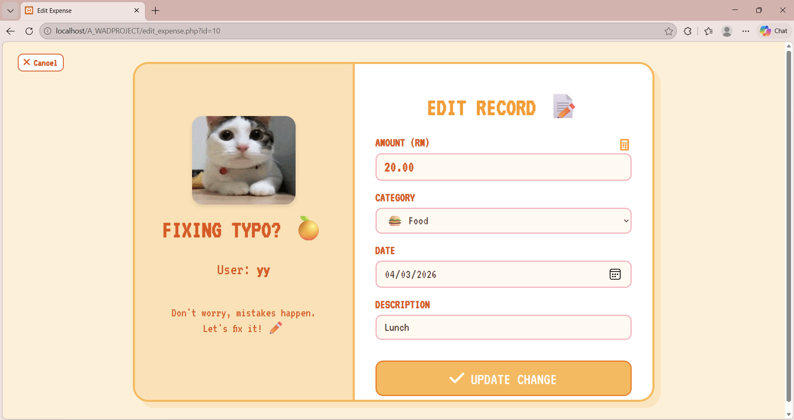

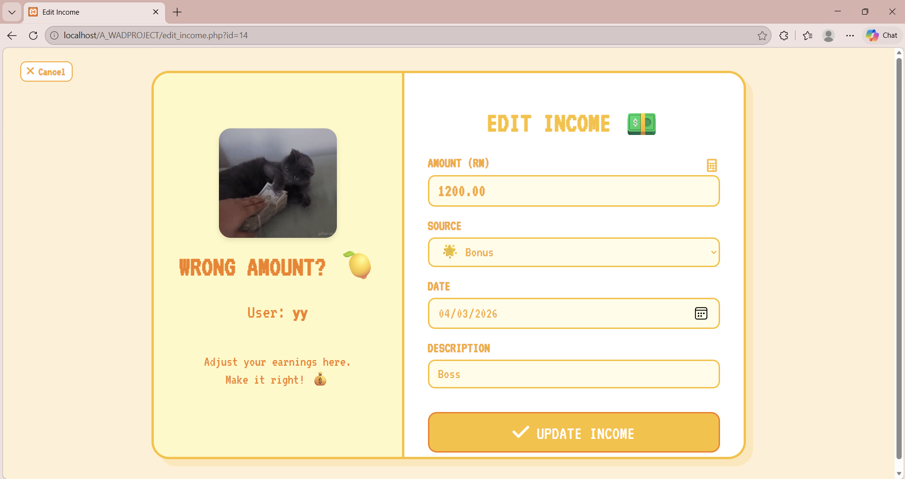

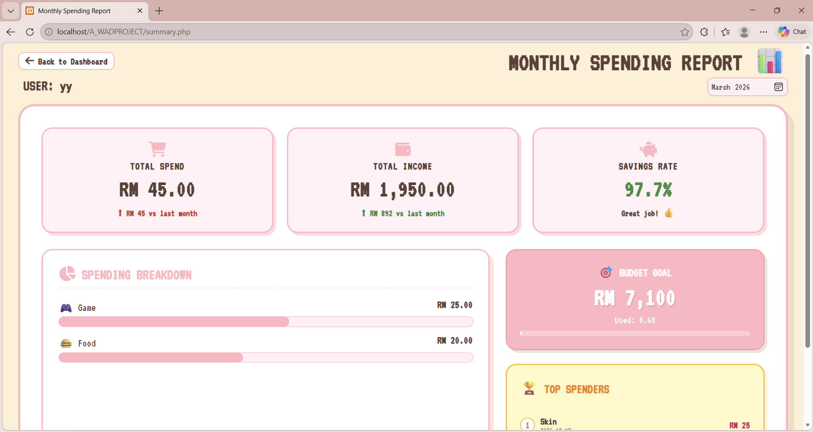

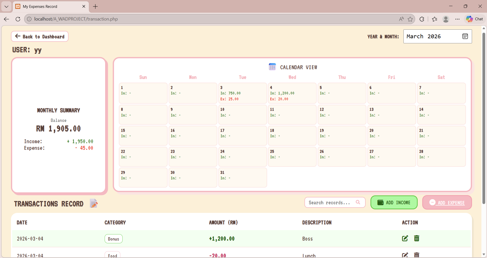
